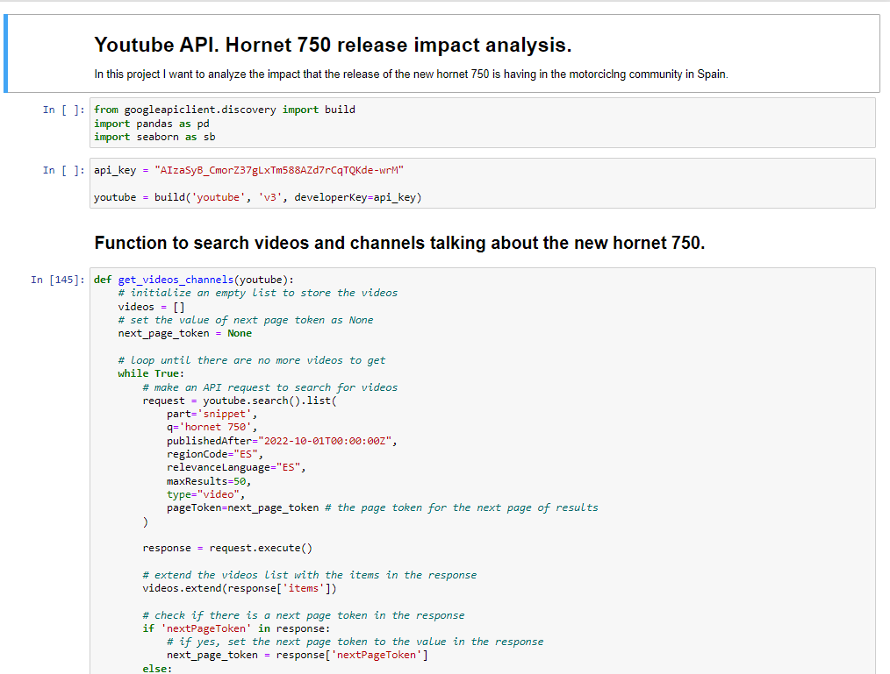

# Youtube API scrapping. Hornet 750 release impact analysis.

The objective of this project is to analyze the impact that the release of the new hornet 750 is having in the motorciclng community in Spain. In orded to do so I will be using python with pandas for data manipulation, seaborn for data visualization and the google API client to connect to the youtube API.

Please reffer to [main.ipynb](main.ipynb) to see the analysis in jupiter notebook.

